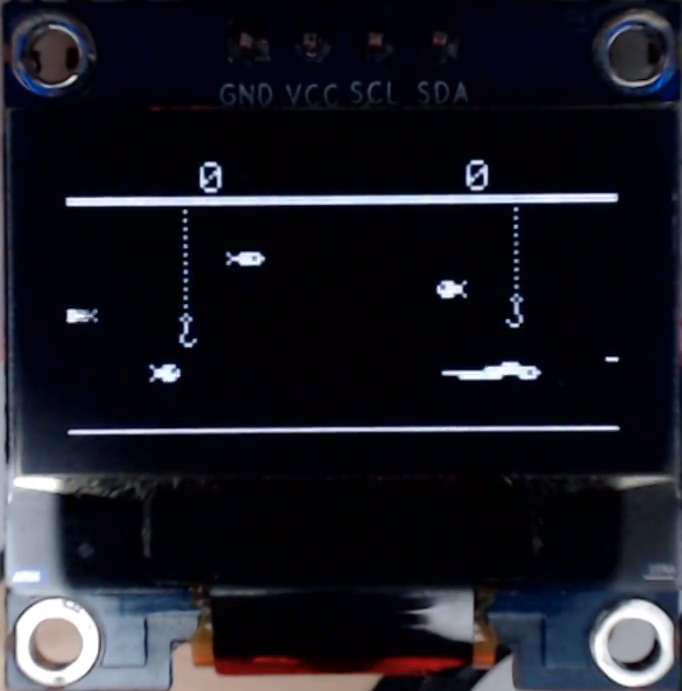

# SSD1306GFX
This library is developed for making games and other low latency interactives on the Atmel ATTiny85 Microcontroller and 128x64px SSD1306 OLED screen. 



## The problem
This chip has only 512 bytes of ram, not enough for a full screen buffer. My solution is to employ a single pixel column buffer ( 64bits ), the draw loop then iterates over all draw instructions for each column of the screen. This drawback is that this is computationaly more costly than using a full screen buffer, but when clocked at 8Mhz this leaves plenty of clock cycles for game code.

## Features

* Supports multiple blend modes
* Position text and graphics anywhere on screen
* Choose start and end 8bit row ranges to draw to, improving framerate when not redrawing all rows.

## Missing features

* Currently no line or circle draw methods, please add to issues if you'd like them.

### Draw loop


```
screen.startVertical();
  do
  {
    // your screen draw instructions here
    
  } while (screen.nextColumn());
```

### Documentation TODO

* how to use progmem to store large graphics
* how to convert images files
* document all methods
